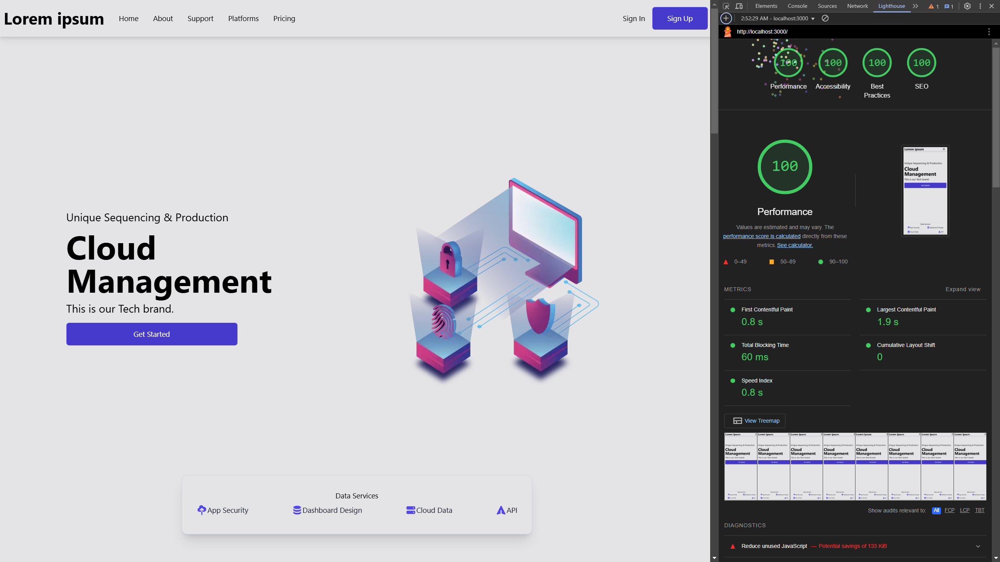

# Cloud Landing Page

A production-ready, fully responsive landing page template built with **React 19**, **TypeScript**, and **Tailwind CSS 4**. This project is designed to serve as a polished starting point for marketing sites, SaaS products, or any cloud-oriented service that requires a professional web presence. It achieves a perfect Lighthouse performance score out of the box and is deployable to GitHub Pages with a single command.

---

## Table of Contents

- [Overview](#overview)
- [Live Demo](#live-demo)
- [Features](#features)
- [Project Structure](#project-structure)
- [Prerequisites](#prerequisites)
- [Installation](#installation)
- [Running the Development Server](#running-the-development-server)
- [Available Scripts](#available-scripts)
- [Component Architecture](#component-architecture)
- [Configuration](#configuration)
  - [TypeScript](#typescript-configuration)
  - [Type Declarations](#type-declarations)
  - [Tailwind CSS](#tailwind-css-configuration)
  - [PostCSS](#postcss-configuration)
- [Styling Conventions](#styling-conventions)
- [Deployment](#deployment)
- [CI/CD and Dependency Management](#cicd-and-dependency-management)
- [Browser Support](#browser-support)
- [Contributing](#contributing)
- [Resources](#resources)
- [License](#license)
- [Preview](#preview)
- [Lighthouse Score](#lighthouse-score)

---

## Overview

This repository contains a single-page application (SPA) that renders a complete, multi-section marketing landing page. The page is structured as a vertical scroll experience composed of distinct, purpose-built sections: a fixed navigation bar, a full-screen hero, an about section with key statistics, a support/contact section, an all-in-one platform features section, a pricing tier section, and a footer with link columns, an email newsletter signup, and social media links.

All sections communicate via smooth scroll anchors powered by `react-scroll`, and the entire page is fully responsive across mobile, tablet, and desktop viewports using Tailwind CSS utility classes and CSS Grid.

The codebase enforces strict TypeScript compilation — every file is type-checked with no implicit `any`, strict null checks, no unused variables or parameters, and no unreachable code. This approach ensures long-term maintainability and makes onboarding new contributors straightforward, since the compiler catches entire categories of bugs at build time.

---

## Live Demo

The project is deployed to GitHub Pages at:

```text
https://milliorn.github.io/cloud-landing-page/
```

---

## Features

- **Fully Responsive Layout** — adapts seamlessly to mobile, tablet, and widescreen desktop using Tailwind CSS breakpoints (`sm`, `md`, `lg`).
- **Fixed Navigation Bar** — stays pinned to the top of the viewport on scroll with a drop shadow. Includes a hamburger menu that toggles a slide-in drawer on small screens.
- **Smooth Scroll Navigation** — all nav links use `react-scroll` to animate the page to the corresponding section rather than performing a hard jump.
- **Hero Section** — full-screen landing area with a heading, call-to-action, a hero image, and a row of service icon chips (App Security, Dashboard Design, Cloud Data, API).
- **About Section** — highlights key business metrics (100% Completion, 24/7 Delivery, 100% Transactions) in bold stat cards alongside descriptive copy and a feature list.
- **Support Section** — full-bleed background image section with floating cards for Sales, Technical Support, and General Inquiries, each with a "Contact Us" call-to-action.
- **Platform Section** — "All-In-One Platform" feature grid showcasing four platform capabilities with checkmark icons.
- **Pricing Section** — two-tier pricing layout (Standard and Premium) with feature checklists using a reusable `CheckMark` component.
- **Footer** — four link columns (Solutions, Company, Legal, Support), an email newsletter subscription input, a dynamic copyright year, and social media icon links.
- **Perfect Lighthouse Score** — optimized for Performance, Accessibility, Best Practices, and SEO.
- **Strict TypeScript** — full strict mode compilation with zero tolerance for implicit types, unused symbols, or unreachable code.
- **Automated Dependency Management** — Dependabot keeps npm packages and GitHub Actions up to date on a monthly schedule, with an automerge workflow that handles patch and minor updates automatically.

---

## Project Structure

Below is the full directory tree of the repository, annotated with the role of each file and directory.

```text
cloud-landing-page/
│
├── .github/
│   ├── dependabot.yml              # Dependabot configuration (monthly npm + actions updates)
│   └── workflows/
│       └── automerge.yml           # Auto-approves/merges patch & minor Dependabot PRs
│
├── build/                          # Production build output (generated, not committed)
│
├── public/
│   ├── cyber-bg.webp               # Hero section background image (WebP for performance)
│   ├── favicon.ico                 # Browser tab icon
│   ├── index.html                  # HTML shell with <div id="root"> mount point
│   ├── lighthouse.png              # Lighthouse score screenshot (used in README)
│   ├── logo192.png                 # PWA icon (192x192)
│   ├── logo512.png                 # PWA icon (512x512)
│   ├── manifest.json               # Web app manifest for PWA metadata
│   ├── preview.png                 # Landing page screenshot (used in README)
│   ├── robots.txt                  # Search engine crawler instructions
│   └── support.webp                # Support section background image (WebP)
│
├── src/
│   ├── App.tsx                     # Root component; composes all page sections in order
│   ├── index.css                   # Tailwind directives + base layer overrides
│   ├── index.tsx                   # React DOM entry point; mounts <App> into #root
│   ├── react-app-env.d.ts          # Ambient type declarations for CSS modules and CRA types
│   │
│   └── components/
│       ├── About/
│       │   ├── index.tsx           # About section root; renders stat cards
│       │   ├── AboutMappedData.tsx # Renders the mapped stat card grid
│       │   └── AboutText.tsx       # Section heading and descriptive paragraph
│       │
│       ├── Footer/
│       │   ├── index.tsx           # Footer root; renders link columns, copyright, social
│       │   ├── FooterEmail.tsx     # Email newsletter subscription input
│       │   └── FooterSocialMedia.tsx # Social media icon links row
│       │
│       ├── Hero/
│       │   ├── index.tsx           # Hero section root; full-screen layout
│       │   ├── HeroDataServices.tsx # Row of service icon chips
│       │   ├── HeroHeading.tsx     # Main headline, subheadline, and CTA buttons
│       │   └── HeroImage.tsx       # Hero illustration/image panel
│       │
│       ├── Navbar/
│       │   ├── index.tsx           # Navbar root; manages mobile menu open/close state
│       │   ├── NavbarLinks.tsx     # Desktop nav link list; exports navLinks data array
│       │   └── NavHandlers.tsx     # Mobile hamburger drawer; consumes navLinks
│       │
│       ├── Pricing/
│       │   ├── index.tsx           # Pricing section root; overlay + card layout
│       │   ├── PricingCardLeft.tsx # Standard tier card content
│       │   ├── PricingCardRight.tsx # Premium tier card content
│       │   ├── PricingCards.tsx    # PricingTier component; renders both pricing card columns
│       │   ├── PricingMonth.tsx    # Reusable monthly price display sub-component
│       │   └── PricingText.tsx     # Pricing section heading and subtitle
│       │
│       ├── Support/
│       │   ├── index.tsx           # Support section root; background image + cards
│       │   └── SupportText.tsx     # Section heading and subtitle
│       │
│       ├── CheckMark.tsx           # Reusable checkmark icon + text row component
│       ├── GetStarted.tsx          # Reusable "Get Started" button component
│       ├── Icon.tsx                # Reusable icon wrapper for react-icons components
│       ├── Login.tsx               # Sign In and Sign Up buttons in the navbar
│       └── Platform.tsx            # "All-In-One Platform" section with feature grid
│
├── .gitignore                      # Git ignore rules
├── LICENSE                         # MIT License (Copyright 2022 Scott Milliorn)
├── package.json                    # Project metadata, dependencies, and npm scripts
├── package-lock.json               # Exact dependency lock file
├── postcss.config.js               # PostCSS plugin pipeline configuration
├── README.md                       # This file
├── tailwind.config.js              # Tailwind CSS content paths and theme configuration
└── tsconfig.json                   # TypeScript compiler options
```

---

## Prerequisites

Before setting up this project, ensure you have the following tools installed on your system.

### Node.js and npm

This project requires **Node.js 18 or higher** and a compatible version of npm. The build toolchain (`react-scripts`) and all dependencies assume a modern Node.js runtime.

To check your current versions:

```bash
node --version
npm --version
```

If you do not have Node.js installed, download it from the [official Node.js website](https://nodejs.org/). It is recommended to use a version manager such as [nvm](https://github.com/nvm-sh/nvm) (Linux/macOS) or [nvm-windows](https://github.com/coreybutler/nvm-windows) (Windows) to manage multiple Node.js versions.

### Git

Git is required to clone the repository.

```bash
git --version
```

If Git is not installed, download it from [git-scm.com](https://git-scm.com/).

### Optional: GitHub CLI

The `gh` CLI is used by the automerge GitHub Actions workflow. You do not need it to run or develop the project locally, but it is useful if you plan to interact with the repository's pull requests from the command line.

---

## Installation

Follow these steps exactly to get the project running locally from scratch.

### Step 1: Clone the repository

```bash
git clone https://github.com/milliorn/cloud-landing-page.git
```

### Step 2: Navigate into the project directory

```bash
cd cloud-landing-page
```

### Step 3: Install all dependencies

```bash
npm install
```

This command reads `package.json` and `package-lock.json` and installs every runtime and development dependency into the `node_modules/` directory. The lock file guarantees that every developer and every CI environment installs the exact same dependency versions.

> **Note:** Do not delete `package-lock.json`. It ensures reproducible installs across all environments. If you need to update dependencies, use `npm update` or let Dependabot handle it via pull requests.

---

## Running the Development Server

Once installation is complete, start the local development server with:

```bash
npm start
```

This launches the Create React App development server. Open your browser and navigate to:

```text
http://localhost:3000
```

The development server provides:

- **Hot Module Replacement (HMR)** — the browser automatically reloads when you save changes to any source file.
- **React Strict Mode** — components are rendered twice in development to surface side effects. This is intentional and does not affect production builds.
- **Inline error overlay** — TypeScript and ESLint errors appear as an overlay in the browser, making it unnecessary to constantly watch the terminal.
- **Source maps** — browser developer tools map minified code back to the original TypeScript source files, enabling straightforward debugging.

> **Port conflict:** If port 3000 is already in use, CRA will prompt you to start on the next available port. Alternatively, you can set a custom port by prefixing the command: `PORT=3001 npm start` (Linux/macOS) or `set PORT=3001 && npm start` (Windows cmd).

---

## Available Scripts

All scripts are defined in `package.json` under the `"scripts"` key and invoked via `npm run <script-name>`.

### `npm start`

Starts the Webpack development server on `http://localhost:3000`. The server watches all files under `src/` for changes and performs hot reloads.

### `npm run build`

Compiles the application into an optimized static bundle in the `build/` directory. The production build performs:

- Minification of JavaScript and CSS
- Tree-shaking to eliminate unused code
- Content hashing of output filenames for effective long-term browser caching
- Image and asset optimization

The `build/` directory is self-contained and can be served by any static file server or CDN.

### `npm run predeploy`

This script runs **automatically** before `npm run deploy`. It executes `npm run build` to ensure a fresh production build exists before deployment. You do not need to call this manually.

### `npm run deploy`

Deploys the contents of the `build/` directory to the `gh-pages` branch of the repository using the `gh-pages` npm package. GitHub Pages serves the site from that branch.

Full deployment sequence:

```bash
npm run deploy
# Internally runs: npm run predeploy && gh-pages -d build
# Which runs:      npm run build    && gh-pages -d build
```

After the command completes, the live site at `https://milliorn.github.io/cloud-landing-page/` will reflect the new build within a few minutes.

### `npm test`

Launches the Jest test runner in interactive watch mode. Tests are co-located with source files following the CRA convention (`*.test.tsx` or `*.spec.tsx` files).

### `npm run eject`

**This is a one-way, irreversible operation.** Ejecting copies the full Webpack, Babel, ESLint, and Jest configuration out of `react-scripts` and into the project root, giving you full manual control. Only eject if you have a specific configuration requirement that cannot be accomplished through CRA's supported override mechanisms. There is no undo.

### `npm run tsc:build`

Runs the TypeScript compiler (`tsc`) against `tsconfig.json` with `--noEmit`, meaning it performs a full type check of the entire `src/` directory but does not produce any output files. Use this to confirm that the codebase is type-clean without running a full Webpack build.

```bash
npm run tsc:build
```

If there are no type errors, the command exits silently with code 0. Any type errors are printed to stdout with file path, line number, and a descriptive message.

### `npm run tsc:watch`

Same as `tsc:build` but runs in watch mode — the TypeScript compiler stays active and re-checks all files on every save. This is useful as a companion process alongside `npm start` to get type error feedback in the terminal rather than only in the browser overlay.

```bash
npm run tsc:watch
```

### `test:tsc`

An alias for `tsc -p tsconfig.json -w` — equivalent to `tsc:watch`. This is the watch mode variant used during active development.

---

## Component Architecture

The application follows a **flat, section-based component hierarchy**. `App.tsx` is the root component and directly renders each page section in document order. Each section lives in its own subdirectory under `src/components/` and is broken into smaller, focused sub-components.

### Composition Model

```text
App
├── Navbar
│   ├── NavbarLinks (desktop nav links; maps navLinks data array)
│   ├── Login (Sign In and Sign Up buttons)
│   └── NavHandlers (mobile drawer; consumes navLinks)
│
├── Hero
│   ├── HeroHeading (headline + CTA)
│   ├── HeroImage (illustration)
│   └── HeroDataServices (service chips: App Security, Dashboard Design, Cloud Data, API)
│
├── About
│   ├── AboutText (section copy)
│   └── AboutMappedData (stat cards: 100% Completion, 24/7 Delivery, 100% Transactions)
│
├── Support
│   ├── SupportText (section heading)
│   └── (mapped cards: Sales, Technical Support, Inquiries)
│
├── Platform
│   └── (mapped feature rows with Check icons)
│
├── Pricing
│   ├── PricingText (section heading)
│   └── PricingCards (PricingTier; label + price + children)
│       ├── PricingCardLeft (Standard tier content)
│       └── PricingCardRight (Premium tier content)
│
└── Footer
    ├── (mapped link columns: Solutions, Company, Legal, Support)
    ├── FooterEmail (newsletter input)
    └── FooterSocialMedia (social icons)
```

### Key Design Patterns

#### Data-driven rendering with `as const`

Several components define their content as `const` arrays marked with `as const`, then map over them to produce JSX. This keeps content and presentation clearly separated and makes it easy to update copy without touching component logic. For example, the Hero section defines its service chips as:

```tsx
const data = [
  { component: <CloudUpload ... />, p: "App Security" },
  { component: <Database ... />,   p: "Dashboard Design" },
  { component: <Server ... />,     p: "Cloud Data" },
  { component: <PaperAirplane .../>, p: "API" },
] as const;
```

#### Stable list keys with data fields

React requires a stable, unique `key` prop on every element produced by a `map`. This project uses meaningful, stable data fields as keys (for example, `key={e.title}`, `key={e.p}`, `key={to}`) rather than array indices or generated UUIDs. Because the data arrays are defined as `as const` and never reordered at runtime, these values are guaranteed to be stable across renders.

#### Section anchors for smooth scroll

Each top-level section component renders a root `<div>` with an `id` attribute (`id="home"`, `id="about"`, `id="support"`, `id="platforms"`, `id="pricing"`). The `react-scroll` `Link` component in the navbar targets these IDs, animating the scroll position when a nav link is clicked. Each `Link` also carries an `href={#id}` attribute so that search engine crawlers can follow the links without executing JavaScript.

#### Reusable `CheckMark` component

The `CheckMark` component (`src/components/CheckMark.tsx`) renders a single row consisting of a checkmark icon and a text string. It is used throughout the Pricing section to render feature lists, demonstrating the principle of extracting even small UI patterns into reusable primitives.

---

## Configuration

### TypeScript Configuration

`tsconfig.json` configures the TypeScript compiler with strict settings appropriate for a production React application.

```json
{
  "compileOnSave": true,
  "compilerOptions": {
    "allowJs": true,
    "checkJs": true,
    "noImplicitReturns": true,
    "sourceMap": true,
    "allowUnreachableCode": false,
    "esModuleInterop": true,
    "forceConsistentCasingInFileNames": true,
    "isolatedModules": true,
    "jsx": "react",
    "module": "esnext",
    "moduleResolution": "bundler",
    "noEmit": true,
    "noFallthroughCasesInSwitch": true,
    "resolveJsonModule": true,
    "skipLibCheck": true,
    "strict": true,
    "target": "ES2020",
    "noUnusedLocals": true,
    "noUnusedParameters": true,
    "exactOptionalPropertyTypes": true,
    "noUncheckedIndexedAccess": true,
    "noPropertyAccessFromIndexSignature": true,
    "noImplicitOverride": true,
    "allowUnusedLabels": false,
    "lib": ["dom", "dom.iterable", "esnext"]
  },
  "include": ["src"],
  "exclude": ["node_modules"]
}
```

Notable settings explained:

| Option                            | Behavior                                                                                   |
| --------------------------------- | ------------------------------------------------------------------------------------------ |
| `strict: true`                    | Enables the full suite of strict type-checking options as a single flag                    |
| `noUnusedLocals`                  | The compiler errors on declared-but-unused local variables                                 |
| `noUnusedParameters`              | The compiler errors on declared-but-unused function parameters                             |
| `allowUnreachableCode: false`     | The compiler errors on code that can never be reached                                      |
| `allowUnusedLabels: false`        | The compiler errors on unused statement labels                                             |
| `exactOptionalPropertyTypes`      | Optional properties must not be assigned `undefined` explicitly; they must be omitted      |
| `noUncheckedIndexedAccess`        | Index signature access returns `T \| undefined`, forcing null checks on array/object reads |
| `noPropertyAccessFromIndexSignature` | Properties on index-signed types must be accessed with bracket notation              |
| `noImplicitOverride`              | Class members overriding a base class member must carry the `override` keyword             |
| `isolatedModules`                 | Every file must be a module; required by Babel's per-file transpilation                    |
| `noEmit: true`                    | TypeScript performs type checking only; Webpack/Babel handles transpilation                |
| `target: "ES2020"`                | Output targets ES2020 for modern browser compatibility                                     |
| `moduleResolution: "bundler"`     | Uses bundler-aware module resolution, aligned with Webpack/Vite conventions                |
| `sourceMap: true`                 | Generates `.map` files for debugging in browser DevTools                                   |

### Type Declarations

`src/react-app-env.d.ts` provides ambient type declarations for modules that do not ship with TypeScript definitions. This file enables TypeScript to understand third-party libraries and non-JavaScript module imports such as CSS files.

```typescript
/// <reference types="react-scripts" />
declare module "*.css";
```

The file includes:

- A triple-slash reference directive that loads type definitions from `react-scripts`, enabling Create React App's extended types.
- A wildcard module declaration for all `.css` files, allowing TypeScript to accept side-effect CSS imports such as `import "./index.css"` without throwing "Cannot find module" errors.

Without the `declare module "*.css";` declaration, importing CSS files in TypeScript would fail compilation. This declaration tells TypeScript that any `.css` file import is valid and should be treated as a module with an implicit `any` type. Webpack's CSS loader handles the actual processing at build time.

### Tailwind CSS Configuration

`tailwind.config.js` configures Tailwind's content scanning and theme extension.

```js
module.exports = {
  content: ["./src/**/*.{js,jsx,ts,tsx}"],
  theme: {
    extend: {},
  },
  plugins: [],
};
```

The `content` array tells Tailwind which files to scan for class names during the build. In production, Tailwind's JIT engine removes all unused utility classes, keeping the final CSS bundle minimal. All class names used anywhere in `src/` are preserved; everything else is purged.

To extend the theme (add custom colors, fonts, spacing, etc.), add values inside `theme.extend`. Custom values added there merge with and extend Tailwind's defaults rather than replacing them.

### PostCSS Configuration

`postcss.config.js` defines the CSS processing pipeline applied to every stylesheet.

```js
module.exports = {
  plugins: {
    "postcss-import": {},
    tailwindcss: {},
    autoprefixer: {},
  },
};
```

The plugins run in the order listed:

1. **`postcss-import`** — resolves `@import` statements in CSS files, inlining the imported stylesheets before any other processing occurs.
2. **`tailwindcss`** — processes Tailwind's `@tailwind base`, `@tailwind components`, and `@tailwind utilities` directives, generating the complete utility class output.
3. **`autoprefixer`** — reads the project's `browserslist` targets from `package.json` and inserts vendor-prefixed CSS properties (e.g., `-webkit-`, `-moz-`) where needed for compatibility.

---

## Styling Conventions

### Utility-First with Tailwind

All layout, spacing, color, and typography decisions are expressed as Tailwind utility classes applied directly to JSX elements. There are no separate SCSS or CSS module files per component.

### Base Layer Overrides

`src/index.css` uses Tailwind's `@layer base` directive to apply opinionated global defaults to HTML elements:

```css
@layer base {
  li {
    @apply p-4;
  }

  button {
    @apply text-white border bg-indigo-600 border-indigo-600
           hover:bg-transparent hover:text-indigo-600 rounded-md;
  }
}
```

This means every `<button>` element in the application inherits the indigo brand color and hover behavior without needing to repeat those classes on each element individually. Overrides for specific buttons can be applied by adding more specific utility classes at the component level.

### Responsive Breakpoints

Tailwind's mobile-first breakpoints are used throughout:

| Prefix   | Minimum Width |
| -------- | ------------- |
| _(none)_ | 0px (mobile)  |
| `sm:`    | 640px         |
| `md:`    | 768px         |
| `lg:`    | 1024px        |
| `xl:`    | 1280px        |

Components use class patterns such as `grid md:grid-cols-2` (single column on mobile, two columns on tablet and above) and `hidden md:flex` (hidden on mobile, flex on tablet and above).

---

## Deployment

This project deploys to **GitHub Pages** using the `gh-pages` npm package. The deployment target is the `gh-pages` branch of this repository.

### One-Command Deploy

```bash
npm run deploy
```

This single command:

1. Runs `npm run build` (via the `predeploy` hook) to produce the optimized production bundle in `build/`.
2. Pushes the contents of `build/` to the `gh-pages` branch using `gh-pages -d build`.
3. GitHub Pages picks up the new commit on `gh-pages` and serves it at the configured URL.

### Homepage URL

The `homepage` field in `package.json` must match the GitHub Pages URL. The `react-scripts` build process uses this value to set the correct public URL for all asset paths (images, JS chunks, CSS) in the production build. If you fork this repository and deploy to your own GitHub Pages account, update this URL accordingly.

### Custom Domain

To use a custom domain with GitHub Pages:

1. Add a `CNAME` file to the `public/` directory containing your domain (e.g., `example.com`).
2. Configure your DNS provider to point to GitHub's Pages servers.
3. Enable the custom domain in the repository's **Settings → Pages** section.
4. Update the `homepage` value in `package.json` to your custom domain.

---

## CI/CD and Dependency Management

### Dependabot

`.github/dependabot.yml` configures GitHub's Dependabot service to automatically open pull requests when newer versions of dependencies are available.

```yaml
version: 2
updates:
  - package-ecosystem: "github-actions"
    directory: "/"
    schedule:
      interval: "monthly"

  - package-ecosystem: "npm"
    directory: "/"
    schedule:
      interval: "monthly"
    ignore:
      - dependency-name: "*"
        update-types: ["version-update:semver-major"]
```

Dependabot scans both npm packages and GitHub Actions dependencies monthly. Major version bumps for npm packages are ignored — these require manual review due to the potential for breaking changes. Patch and minor updates are automatically submitted as pull requests.

### Automerge Workflow

`.github/workflows/automerge.yml` runs on every pull request opened by `dependabot[bot]`. It uses the `dependabot/fetch-metadata` action to determine the semver update type and takes one of three actions:

| Update Type                      | Action                                                                                            |
| -------------------------------- | ------------------------------------------------------------------------------------------------- |
| `semver-patch` or `semver-minor` | Auto-approves the PR and enables squash merge                                                     |
| `semver-major`                   | Creates a `dependabot-major-auto-closed` label, closes the PR, and posts a comment explaining why |
| null / empty update type         | Creates a `dependabot-update-type-null` label, closes the PR, and posts a comment                 |

This keeps the `main` branch current with low-risk dependency updates without requiring manual intervention for every patch release.

---

## Browser Support

Browser targets are defined in `package.json` under the `"browserslist"` key.

Production:

- Browsers with greater than 0.2% global usage share
- Excludes browsers classified as "dead" (no official support or updates for 24+ months)
- Excludes Opera Mini

Development:

- Last 1 version of Chrome
- Last 1 version of Firefox
- Last 1 version of Safari

These targets are consumed by both `autoprefixer` (to determine which CSS vendor prefixes to add) and `@babel/preset-env` (to determine which JavaScript syntax transforms to apply).

---

## Contributing

Contributions are welcome. To contribute:

1. **Fork** the repository on GitHub.
2. **Create a feature branch** from `main`:

   ```bash
   git checkout -b feature/your-feature-name
   ```

3. **Make your changes.** Run `npm run tsc:build` to confirm there are no TypeScript errors before committing.
4. **Commit** with a clear, descriptive message:

   ```bash
   git commit -m "Add: brief description of change"
   ```

5. **Push** to your fork:

   ```bash
   git push origin feature/your-feature-name
   ```

6. **Open a Pull Request** against the `main` branch of this repository and describe what was changed and why.

### Code Standards

- All new code must be written in TypeScript. No plain `.js` files in `src/`.
- TypeScript must compile cleanly with no errors (`npm run tsc:build`).
- Follow the existing component structure: one directory per section, one `index.tsx` as the section root, sub-components in the same directory.
- Use Tailwind utility classes for all styling. Do not introduce new CSS files unless strictly necessary.
- Do not use array indices as React `key` props. Use stable, meaningful data fields as keys (e.g. `key={item.label}`).

---

## Resources

The following documentation and references cover every technology used in this project.

- [React Documentation](https://react.dev) — Official React docs
- [Create React App Documentation](https://create-react-app.dev/docs/getting-started) — CRA getting started guide
- [TypeScript Handbook](https://www.typescriptlang.org/docs/handbook/react.html) — TypeScript with React
- [TypeScript `tsconfig` Reference](https://www.typescriptlang.org/tsconfig) — All compiler options explained
- [Tailwind CSS Documentation](https://tailwindcss.com/docs) — Utility class reference
- [Install Tailwind CSS with Create React App](https://tailwindcss.com/docs/guides/create-react-app) — Setup guide
- [PostCSS Documentation](https://postcss.org) — PostCSS plugin system
- [react-scroll on npm](https://www.npmjs.com/package/react-scroll) — Smooth scroll API and options
- [Heroicons](https://github.com/tailwindlabs/heroicons) — SVG icon library by Tailwind Labs
- [React Icons](https://react-icons.github.io/react-icons/) — Icon packs for React
- [gh-pages on npm](https://www.npmjs.com/package/gh-pages) — GitHub Pages deployment utility
- [Dependabot Configuration](https://docs.github.com/github/administering-a-repository/configuration-options-for-dependency-updates) — Dependabot `dependabot.yml` reference

---

## License

This project is licensed under the **MIT License**.

Copyright (c) 2022 Scott Milliorn

Permission is hereby granted, free of charge, to any person obtaining a copy of this software and associated documentation files (the "Software"), to deal in the Software without restriction, including without limitation the rights to use, copy, modify, merge, publish, distribute, sublicense, and/or sell copies of the Software, and to permit persons to whom the Software is furnished to do so, subject to the following conditions:

The above copyright notice and this permission notice shall be included in all copies or substantial portions of the Software.

THE SOFTWARE IS PROVIDED "AS IS", WITHOUT WARRANTY OF ANY KIND, EXPRESS OR IMPLIED, INCLUDING BUT NOT LIMITED TO THE WARRANTIES OF MERCHANTABILITY, FITNESS FOR A PARTICULAR PURPOSE AND NONINFRINGEMENT. IN NO EVENT SHALL THE AUTHORS OR COPYRIGHT HOLDERS BE LIABLE FOR ANY CLAIM, DAMAGES OR OTHER LIABILITY, WHETHER IN AN ACTION OF CONTRACT, TORT OR OTHERWISE, ARISING FROM, OUT OF OR IN CONNECTION WITH THE SOFTWARE OR THE USE OR OTHER DEALINGS IN THE SOFTWARE.

See the [LICENSE](LICENSE) file for the full text.

---

## Preview


---

## Lighthouse Score

This project achieves a perfect score across all four Lighthouse audit categories: Performance, Accessibility, Best Practices, and SEO.


